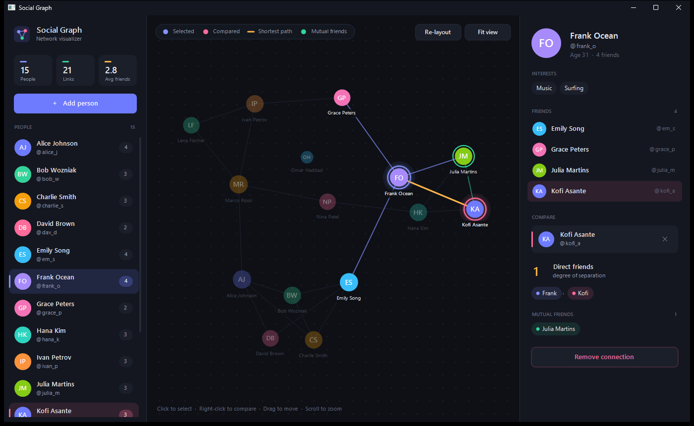

# Social Network Simulator

This repository contains the foundational C++ core logic for a social network simulator. It's built to efficiently manage users, connections, and perform graph analysis.

---

## Features

The C++ core logic provides the following functionalities:

* **User Management:**
    * Add new users with unique IDs, usernames, names, ages, and interests.
    * Retrieve user profiles by ID.
    * List all users in the network.
* **Connection Management:**
    * Establish and remove bidirectional friendships between users.
    * List friends of a specific user.
* **Network Analysis (Graph Algorithms):**
    * Find the **shortest path** (degrees of separation) between any two users using Breadth-First Search (BFS).
    * Identify **common friends** between any two users.
* **Network Data Retrieval:**
    * Efficiently retrieve all users and all connections in formats suitable for later visualization.
* **Network Statistics:**
    * Calculate overall network statistics like total users, total connections, and average friends per user.

---

## Core Technologies

* **Language:** C++
* **Core Data Structures:** `std::map`, `std::vector`, `std::set`, `std::queue`
* **Desktop UI:** Win32 API + GDI+

---

## Desktop App: Social Graph

The `windows-frontend` branch adds **Social Graph**, a native Windows desktop app (Win32 + GDI+, no extra dependencies) that links straight to the `SocialNetwork` classes.



* **Live network graph:** an animated force-directed layout. Drag nodes, pan with the mouse, scroll to zoom, and use **Fit view** / **Re-layout**.
* **People sidebar:** network stats (people, links, average friends) and a list of everyone with their friend counts.
* **Profile panel:** a person's details, interests, and friends. Click a friend to jump to them.
* **Compare two people:** select one person, then right-click (or Ctrl+click) another to see:
    * the **shortest path** (degrees of separation), highlighted on the graph
    * their **mutual friends**
    * a one-click **Connect** / **Remove connection** button
* **Add people:** use the dialog with validation (unique username, age from 1 to 150, comma-separated interests).
* Dark theme, per-monitor DPI aware, and flicker-free double-buffered rendering.

**Keyboard:** `Esc` clears the selection, `Ctrl+N` adds a person, `F` fits the view, `R` re-runs the layout.

### Building

With MinGW-w64 (for example, the MSYS2 `mingw64` toolchain) on your `PATH`:

```bat
build.bat
```

This produces `build\SocialGraph.exe` (the GUI) and `build\network_demo.exe` (the console demo from `main.cpp`).
A `CMakeLists.txt` is also included for Visual Studio / MSVC or CMake + MinGW users.

---

## Contributing

Feel free to open issues or submit pull requests if you would like to add the frontend/application or improvements for the backend logic.
