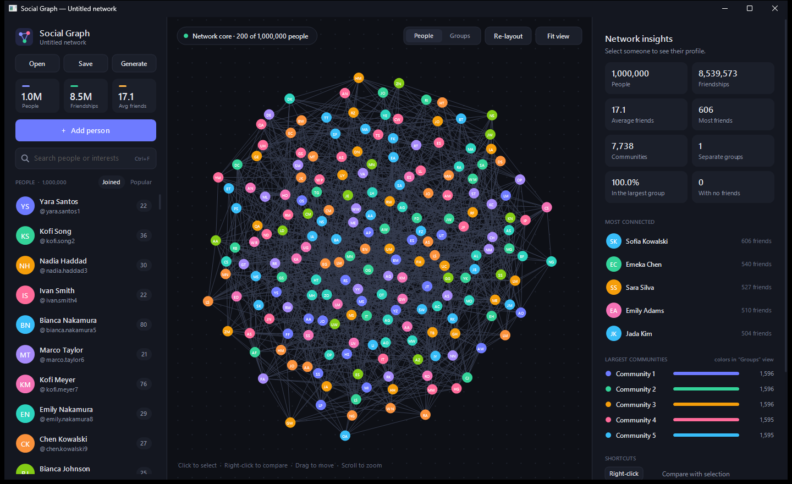
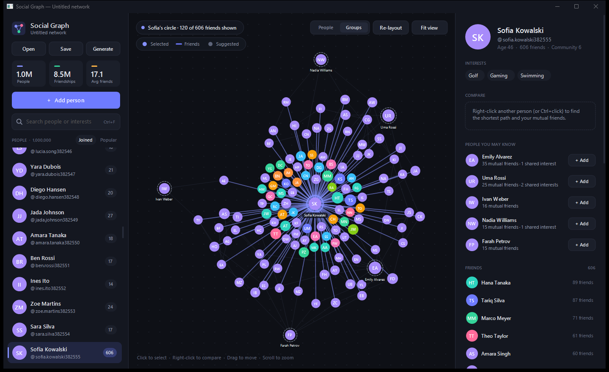

# Social Network Simulator

A C++ social network simulator with a native Windows app for exploring it. The core manages users, friendships and graph analysis, and holds **millions of people in memory**. **Social Graph**, the desktop app, lets you browse, search, compare and edit networks of any size.


---

## Features

### Core library (portable C++17)

* **User management:** add and remove users (usernames are unique), look them up by id or username, and list everyone.
* **Connection management:** add and remove two-way friendships. Every operation returns a precise result (`Ok`, `AlreadyConnected`, `UserNotFound`, …) instead of printing to the console.
* **Graph algorithms:**
    * **Shortest path** (degrees of separation) using a bidirectional breadth-first search.
    * **Mutual friends** by merging two sorted friend lists.
    * **Friend suggestions** ("people you may know"), ranked by mutual friends and shared interests.
* **Network analysis:** statistics, connected components, **community detection** (label propagation), and the most connected people.
* **Persistence:** `.sgraph` files, a simple tab-separated format that streams quickly at millions of rows (see [File format](#file-format)).
* **Synthetic networks:** a generator that produces realistic structure: communities with shared interests, heavy-tailed friend counts and popular hubs, capped at 5,000 friends like Facebook.
* **Force-directed layout:** d3-style, using a Barnes–Hut quadtree for repulsion and a spatial grid for collisions.

### Desktop app (Windows)

* **Interactive graph:** an animated layout with drag, pan and zoom, plus **Fit view** and **Re-layout**. Color people individually or by **community**.
* **Works at any size.** Small networks are drawn in full. Larger ones switch to focused views, so the picture stays readable:
    * **Network core:** the 200 best-connected people at the heart of the network.
    * **Circle:** the selected person, their friends, and suggestions.
    * **Search results:** the best-connected matches.
* **Search** by name, @username or interest. It stays responsive across a million people.
* **Profiles:** interests, friends (most connected first), and **people you may know**, each with a one-click **+ Add**.
* **Compare two people:** shortest path highlighted on the graph, degrees of separation, mutual friends, and connect/disconnect.
* **Network insights:** people, friendships, communities, separate groups, the most connected people, and the largest communities.
* **Files:** Open, Save, drag-and-drop, or `SocialGraph.exe network.sgraph`. You're prompted before unsaved changes are lost.
* **Generate** networks from 15 to 1,000,000 people. Loading, saving, generating and analysis all run in the background with a progress indicator.
* Dark theme, per-monitor DPI aware, and flicker-free double-buffered rendering.

| Network core, 1,000,000 people | One person's circle, with suggestions |
|---|---|
|  |  |

**Keyboard**

| Shortcut | Action |
|---|---|
| Click / Right-click (or Ctrl+Click) | Select / compare with the selected person |
| `Ctrl+F`, then `Enter` | Search; `Enter` selects the first match |
| `Ctrl+N` | Add a person |
| `Ctrl+O` / `Ctrl+S` / `Ctrl+Shift+S` | Open / save / save as |
| `Ctrl+G` | Generate a network |
| `Delete` (twice) | Delete the selected person |
| `Esc` | Clear the comparison, then the selection, then the search |
| `F` / `R` | Fit view / re-run the layout |

---

## Scale

Results from `bench` on the development machine (MinGW GCC 15, `-O2`, one thread):

| | 1M people, 9.4M friendships | 5M people, 47M friendships |
|---|---|---|
| Generate network | 1.7 s | 9.7 s |
| Save / load `.sgraph` | 0.4 s / 1.6 s | 2.2 s / 9.0 s |
| Shortest path (avg. of 1,000 random pairs) | **0.13 ms** (5.5 degrees) | **0.43 ms** (6.0 degrees) |
| Friend suggestions | 0.015 ms | 0.020 ms |
| Mutual friends | < 0.001 ms | < 0.001 ms |
| Connected components | 0.17 s | 1.0 s |
| Community detection | 2.7 s | 21 s |
| Memory (working set) | ~450 MB | ~2.3 GB |

What makes this fast:

* **Contiguous storage indexed by user id.** No tree or hash lookups on the hot path.
* **Sorted friend lists.** "Are they friends?" is a binary search, and mutual friends is a linear merge.
* **Bidirectional BFS.** It grows the smaller frontier from both ends, so a search touches only a tiny part of the graph.
* **Reusable, generation-stamped search buffers.** Queries never allocate or clear per-user arrays.
* **A compact username index.** Open addressing over ids that points back at the stored usernames: about 8–16 bytes per user.

**About "Facebook scale."** Facebook has about 3 billion people and hundreds of billions of friendships, stored in a sharded, replicated service across data centers. This project is built to handle millions of people on a single PC. Going further would mean a different architecture: sharded storage, distributed traversal, and compressed adjacency on disk.

---

## File format

`.sgraph` files are plain UTF-8 text with one record per line and fields separated by tabs:

```
SOCIALGRAPH 1
U	<id>	<username>	<name>	<age>	<interest;interest;...>
E	<id>	<id>
```

Lines starting with `#` are comments. When saving, tabs and newlines inside values become spaces, so every file loads back exactly. If a file is invalid, loading reports the line number and leaves the open network unchanged.

---

## Building

**With MinGW-w64** (for example, the MSYS2 `mingw64` toolchain) on your `PATH`:

```bat
build.bat
```

This builds `build\SocialGraph.exe` (the app), `network_demo.exe` (the console demo from `main.cpp`), `test_core.exe` and `bench.exe`, then runs the tests.

**With CMake** (Visual Studio, MinGW, or Linux; on Linux only the core, tests and benchmark are built):

```bash
cmake -S . -B build
cmake --build build --config Release
ctest --test-dir build -C Release
```

**Benchmark:** `bench [people] [averageFriends]`, for example `bench 1000000 20`.

### Continuous integration and releases

* **CI** runs on every push and pull request: Linux (GCC + CMake), Windows (MSVC + CMake), and Windows (MinGW, both `build.bat` and CMake + Ninja).
* **Releases:** push a tag such as `v1.0.0`. GitHub Actions builds a standalone `SocialGraph.exe` (statically linked, no runtime DLLs) and publishes it with a `.zip` on the Releases page.

---

## Project layout

```
src/
  SocialNetwork.*   graph storage and algorithms
  User.*            user profile
  NetworkIO.*       .sgraph load/save
  Generator.*       synthetic network generator
  Analytics.*       components, communities, most connected
  ForceLayout.*     Barnes-Hut force-directed layout
  WindowsApp.cpp    the Social Graph desktop app
  ui/Draw.*         drawing toolkit (theme, fonts, primitives, hit regions)
  main.cpp          console demo
tests/test_core.cpp unit tests
tools/bench.cpp     scale benchmark
```

---

## Contributing

Feel free to open issues or submit pull requests with improvements to the core or the app.
